# Model fitting
Here, we will show different parameterizations of our model for a house-level risk index for dengue disease in an urban region of Tapachula, Chiapas, Mexico.

- $PC_{DroneImage}$: The number of principal components (PCA) used to represent the *vegetation indices* (NDVI, GNDVI, NDVIre and CIgreen), and cartographic information (DSM and DTM)
- 
Main parameters are:
<table>
 <thead>
  <tr>
   <th style="text-align:left;"> Parameter </th>
   <th style="text-align:right;"> Description </th>
   <th style="text-align:right;"> Values </th>
  </tr>
 </thead>
<tbody>
  <tr>
   <td style="text-align:left;"> $PC_{DroneImage}$ </td>
   <td style="text-align:right;"> The number of principal components (PCA) used to represent the *vegetation indices* (NDVI, GNDVI, NDVIre and CIgreen), and cartographic information (DSM and DTM) </td>
   <td style="text-align:right;"> $\lbrace 1,2 \rbrace$ </td>
  </tr>  
  <tr>
   <td style="text-align:left;"> $nclust$ </td>
   <td style="text-align:right;"> The number of clusters considered to model the spatial relationships between the houses  </td>
   <td style="text-align:right;"> $\lbrace 2, 3, 4, 5, 6 \rbrace$ </td>
  </tr>   
  <tr>
   <td style="text-align:left;"> $k_{nn}$ </td>
   <td style="text-align:right;"> The number of $k$ nearest neighboring houses for defining the connectivities in the agglomerative hierarchical clustering with spatial constraints  </td>
   <td style="text-align:right;"> $\lbrace 3,4,5 \rbrace$ </td>
  </tr>
  <tr>
   <td style="text-align:left;"> $PC_{FAMD}$ </td>
   <td style="text-align:right;"> The number of principal components to be used, obtained with FAMD  </td>
   <td style="text-align:right;"> $\lbrace 2, 3,4,5, 6 \rbrace$ </td>
  </tr>
 <tr>
   <td style="text-align:left;"> $PC_{PLS}$ </td>
   <td style="text-align:right;"> The maximum number of principal components to obtain in PLS to generate our proposed index. Observe that, altough we use just the first score of PLS ($\widetilde{\mathbf{X}}\mathbf{a}_1$), results may vary for different values of $PC_{PLS}$. Also, this parameter must satisfy $PC_{PLS}\leq PC_{FAMD}$ </td>
   <td style="text-align:right;"> $\lbrace 2, 3,4,5, 6 \rbrace$ </td>
  </tr>
</tbody>
</table>

# Evaluation

PLS is a regression model on latent (or canonical) variables, therefore, we have some performance metrics of the methodology, such as sum of squared errors or coefficient determination $R^2$, however, in our case we do not want to get a model with the best predictive performance *per se*, but to obtain a set of components that can represent all covariates we used (from different sources and types) in an useful way and are co-related to our response variable of interest, in such a way that can serve as a risk index. So, we discarded such metrics, because in order to have a good $R^2$, it is very easy to have an overfitted model. Then, our main evaluation critera was the explained inertia obtained with the FAMD procedure according to the $PC_{FAMD}$ variable, and the residuals on log counts of the response variables. 

# Experiments

We did an extensive set of experiments with different parameterizations, however, because we have many possible combinations of the parameters, we will show just some of them.

## Model 1

<table>
 <thead>
  <tr>
   <td style="text-align:left;"> $PC_{DroneImage}$ </td>
   <td style="text-align:left;"> $nclust$ </td>
   <td style="text-align:left;"> $k_{nn}$ </td>
   <td style="text-align:left;"> $PC_{FAMD}$ </td>
   <td style="text-align:left;"> $PC_{PLS}$ </td>
  </tr>
 </thead>
<tbody>
  <tr>
   <td style="text-align:right;"> $1$ </td>
   <td style="text-align:right;"> $2$ </td>
   <td style="text-align:right;"> $3$ </td>
   <td style="text-align:right;"> $2$ </td>
   <td style="text-align:right;"> $2$ </td>
  </tr>
</tbody>
</table>

Explained inertia: 0.72

### Hierarchical clustering with connectivity constraints. 
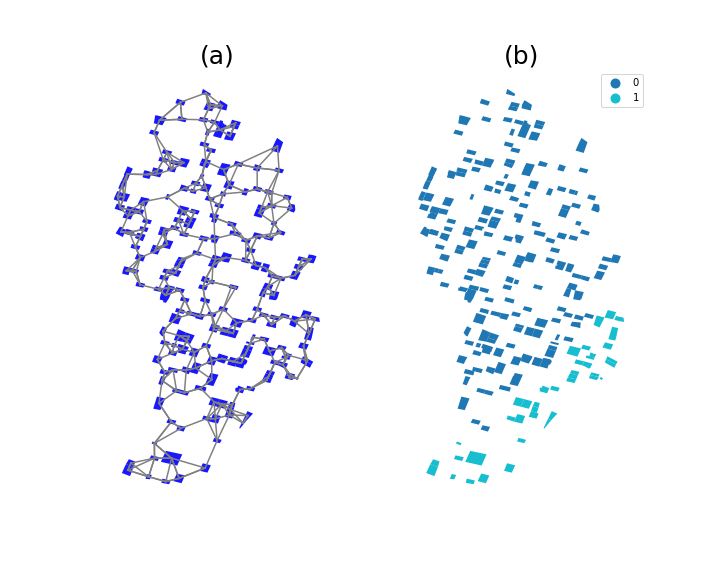

### House-level risk index 
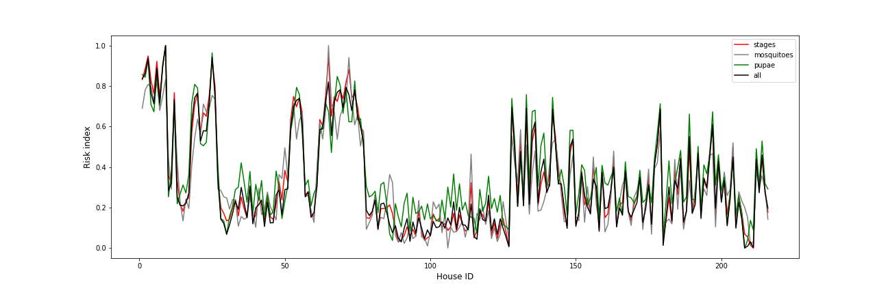

### House-level risk index (geographic distribution)
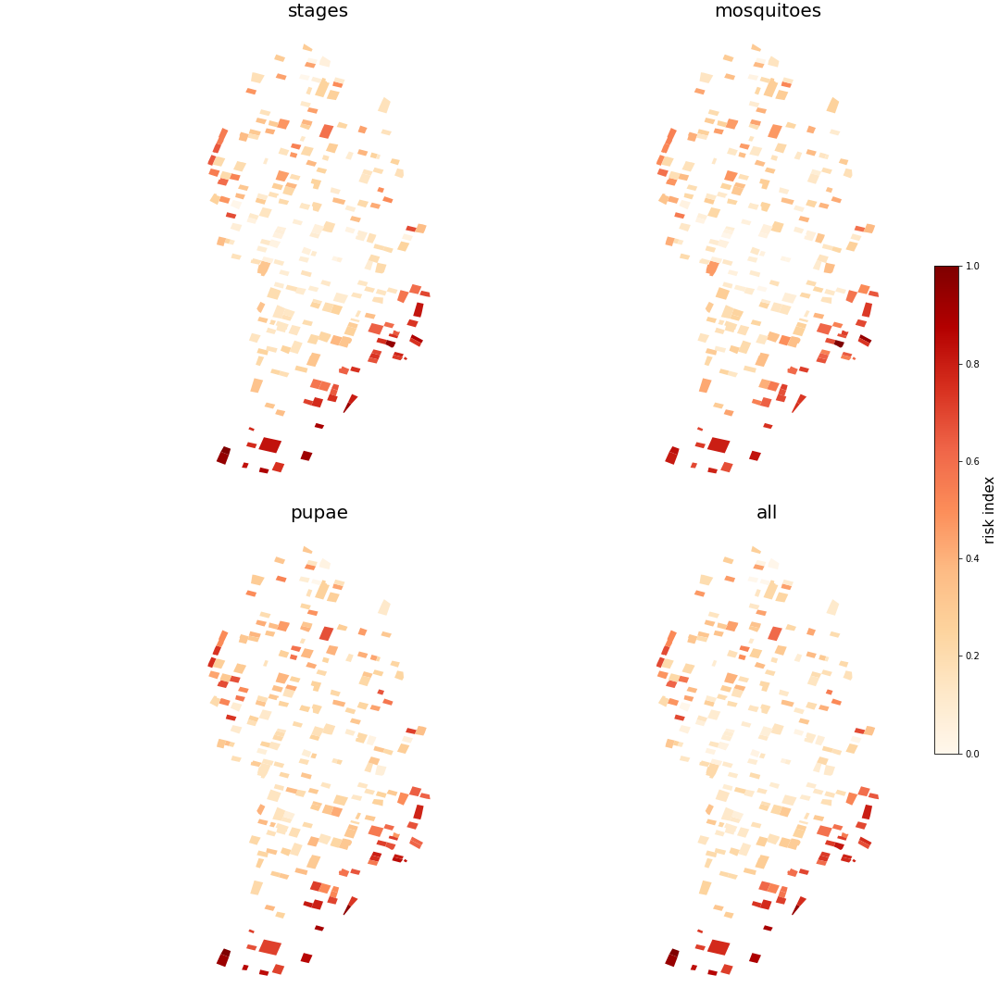

## Model 2

<table>
 <thead>
  <tr>
   <td style="text-align:left;"> $PC_{DroneImage}$ </td>
   <td style="text-align:left;"> $nclust$ </td>
   <td style="text-align:left;"> $k_{nn}$ </td>
   <td style="text-align:left;"> $PC_{FAMD}$ </td>
   <td style="text-align:left;"> $PC_{PLS}$ </td>
  </tr>
 </thead>
<tbody>
  <tr>
   <td style="text-align:right;"> $1$ </td>
   <td style="text-align:right;"> $2$ </td>
   <td style="text-align:right;"> $3$ </td>
   <td style="text-align:right;"> $4$ </td>
   <td style="text-align:right;"> $4$ </td>
  </tr>
</tbody>
</table>

Explained inertia: 0.72

### Hierarchical clustering with connectivity constraints. 

### House-level risk index 
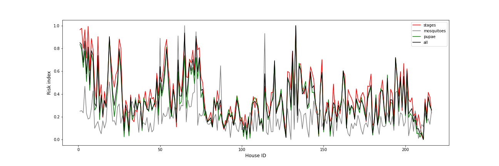

### House-level risk index (geographic distribution)
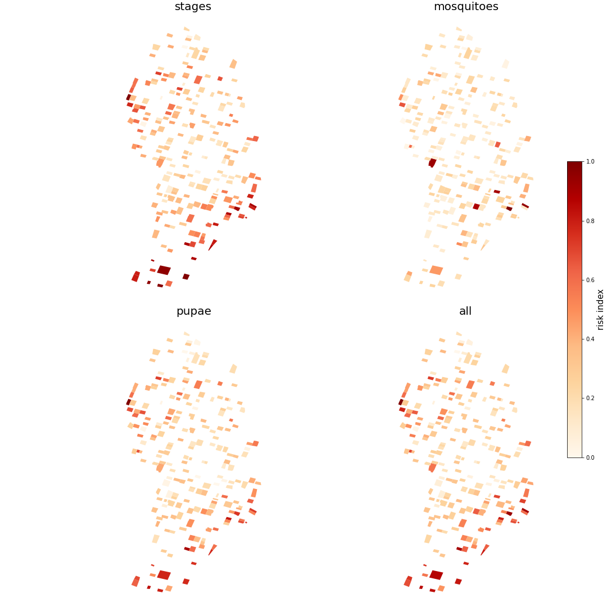

## Model 3 (overfitted)

<table>
 <thead>
  <tr>
   <td style="text-align:left;"> $PC_{DroneImage}$ </td>
   <td style="text-align:left;"> $nclust$ </td>
   <td style="text-align:left;"> $k_{nn}$ </td>
   <td style="text-align:left;"> $PC_{FAMD}$ </td>
   <td style="text-align:left;"> $PC_{PLS}$ </td>
  </tr>
 </thead>
<tbody>
  <tr>
   <td style="text-align:right;"> $1$ </td>
   <td style="text-align:right;"> $2$ </td>
   <td style="text-align:right;"> $3$ </td>
   <td style="text-align:right;"> $6$ </td>
   <td style="text-align:right;"> $6$ </td>
  </tr>
</tbody>
</table>

Explained inertia: 0.72

### Hierarchical clustering with connectivity constraints. 

### House-level risk index 
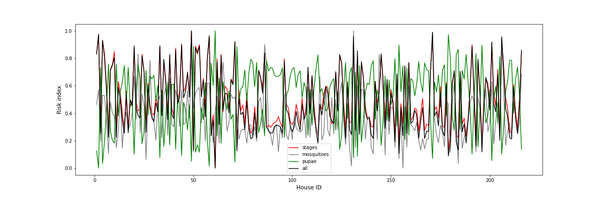

### House-level risk index (geographic distribution)
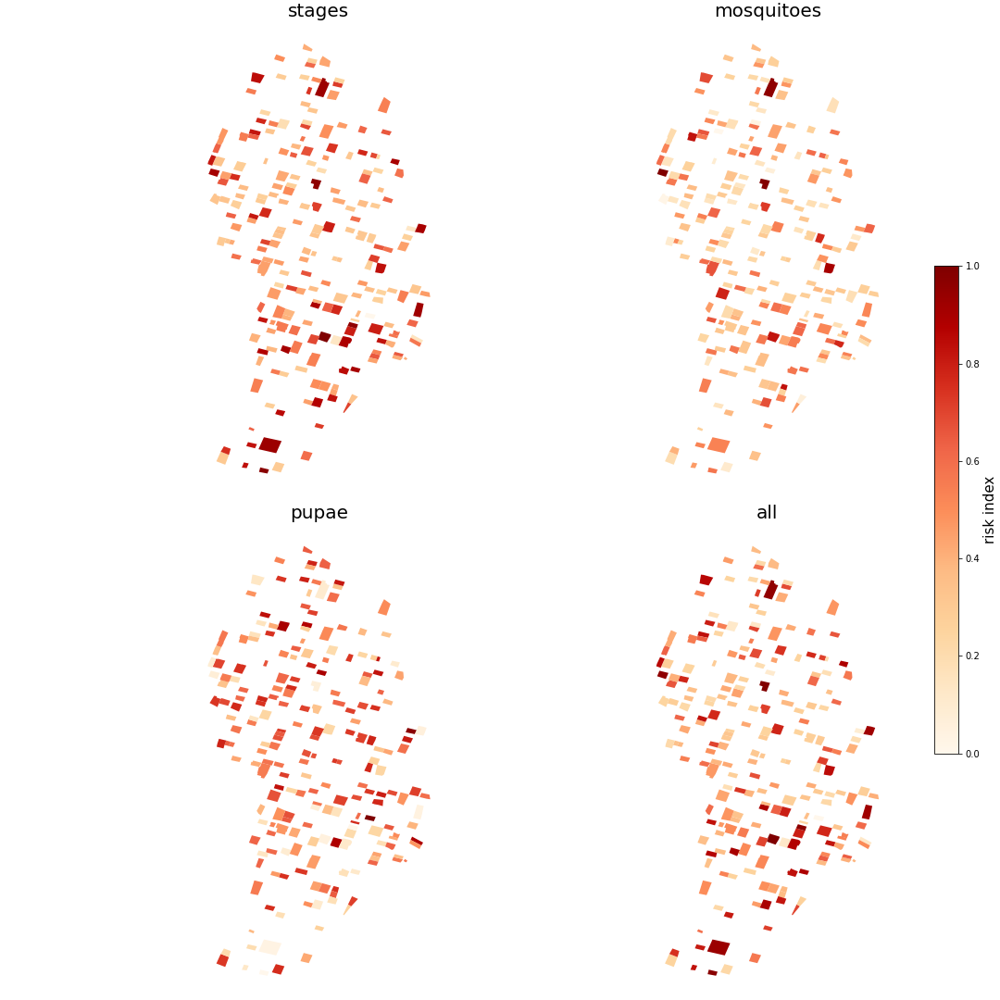

## Model 4

<table>
 <thead>
  <tr>
   <td style="text-align:left;"> $PC_{DroneImage}$ </td>
   <td style="text-align:left;"> $nclust$ </td>
   <td style="text-align:left;"> $k_{nn}$ </td>
   <td style="text-align:left;"> $PC_{FAMD}$ </td>
   <td style="text-align:left;"> $PC_{PLS}$ </td>
  </tr>
 </thead>
<tbody>
  <tr>
   <td style="text-align:right;"> $1$ </td>
   <td style="text-align:right;"> $3$ </td>
   <td style="text-align:right;"> $5$ </td>
   <td style="text-align:right;"> $3$ </td>
   <td style="text-align:right;"> $3$ </td>
  </tr>
</tbody>
</table>

Explained inertia: 0.695

### Hierarchical clustering with connectivity constraints. 
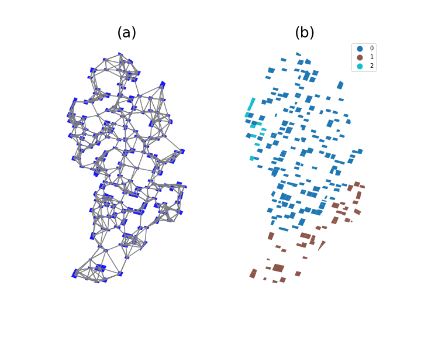

### House-level risk index 
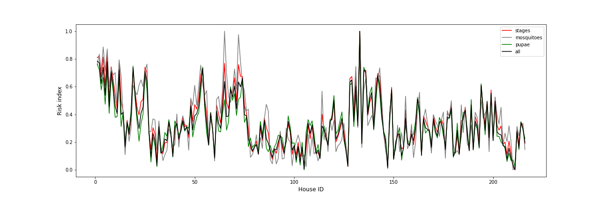

### House-level risk index (geographic distribution)
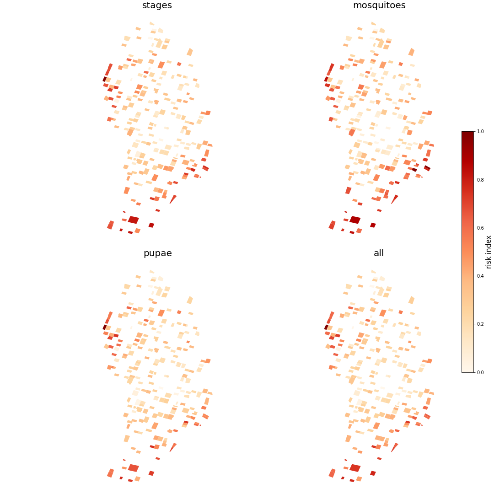

## Model 5

<table>
 <thead>
  <tr>
   <td style="text-align:left;"> $PC_{DroneImage}$ </td>
   <td style="text-align:left;"> $nclust$ </td>
   <td style="text-align:left;"> $k_{nn}$ </td>
   <td style="text-align:left;"> $PC_{FAMD}$ </td>
   <td style="text-align:left;"> $PC_{PLS}$ </td>
  </tr>
 </thead>
<tbody>
  <tr>
   <td style="text-align:right;"> $1$ </td>
   <td style="text-align:right;"> $6$ </td>
   <td style="text-align:right;"> $4$ </td>
   <td style="text-align:right;"> $4$ </td>
   <td style="text-align:right;"> $4$ </td>
  </tr>
</tbody>
</table>

Explained inertia: 0.616

### Hierarchical clustering with connectivity constraints. 
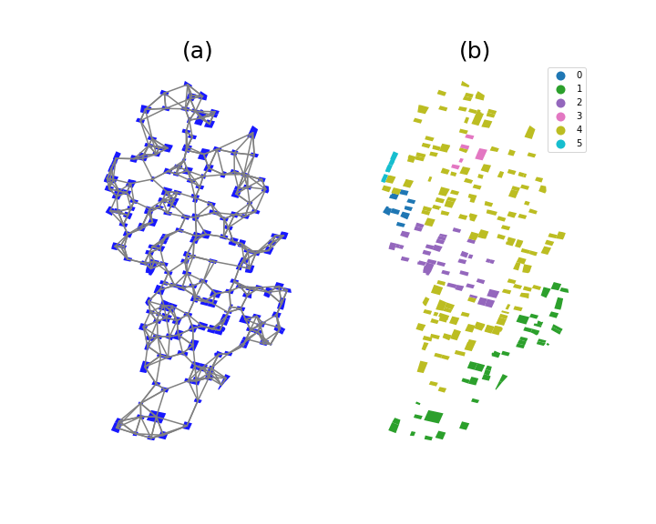

### House-level risk index 
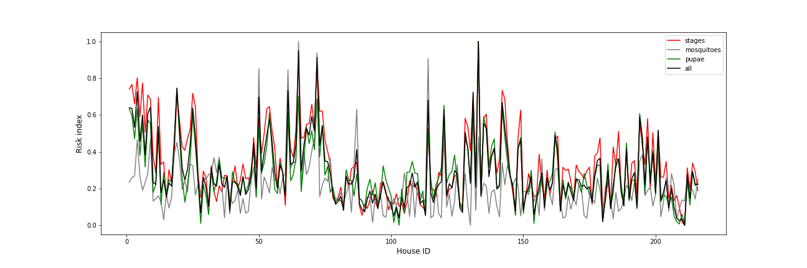

### House-level risk index (geographic distribution)
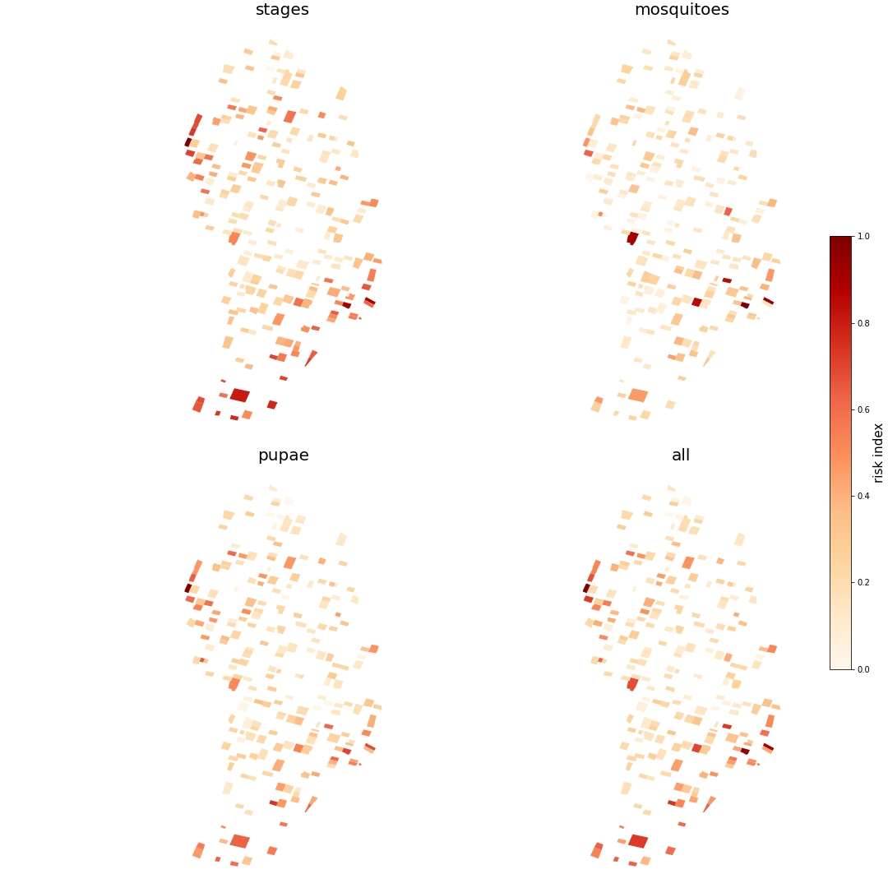

## Model 6

<table>
 <thead>
  <tr>
   <td style="text-align:left;"> $PC_{DroneImage}$ </td>
   <td style="text-align:left;"> $nclust$ </td>
   <td style="text-align:left;"> $k_{nn}$ </td>
   <td style="text-align:left;"> $PC_{FAMD}$ </td>
   <td style="text-align:left;"> $PC_{PLS}$ </td>
  </tr>
 </thead>
<tbody>
  <tr>
   <td style="text-align:right;"> $2$ </td>
   <td style="text-align:right;"> $5$ </td>
   <td style="text-align:right;"> $3$ </td>
   <td style="text-align:right;"> $4$ </td>
   <td style="text-align:right;"> $4$ </td>
  </tr>
</tbody>
</table>

Explained inertia: 0.594

### Hierarchical clustering with connectivity constraints. 
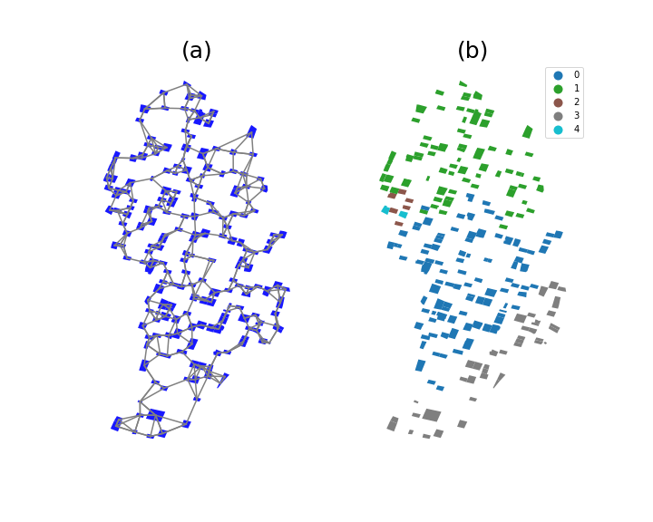

### House-level risk index 
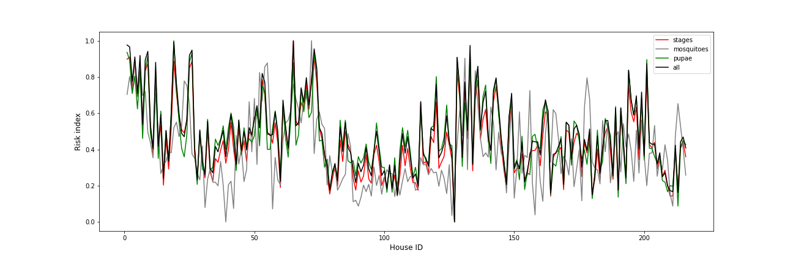

### House-level risk index (geographic distribution)
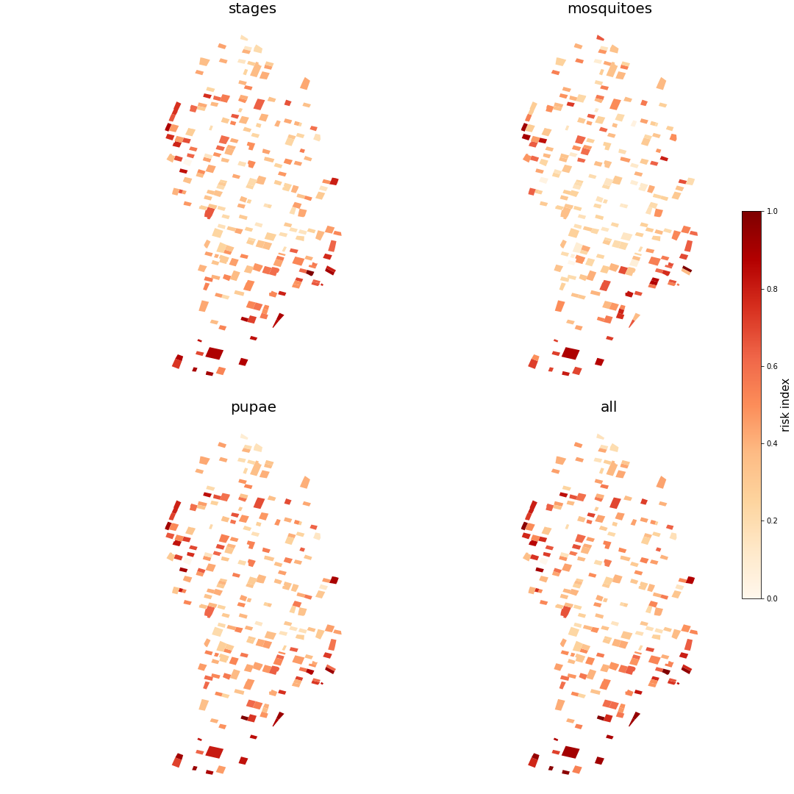

